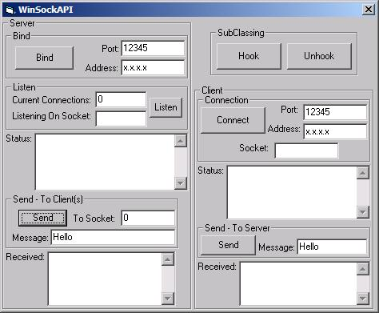



## API \- WinSock OCX replication to Advanced WinSock API Class

### Description

Sox is a 'best of breed' project incorporating many hours of study and testing! With the ability to adjust ALL WinSock API features, eg. KeepAlives, TCP_NODELAY or the Send and Receive buffer sizes, you have the full power and flexability of the API at your disposal! This project utilizes the fastest methods in every aspect, from the Data Buffers to the Sockets Array (all other projects use a 'slow' collection) and is guaranteed to outperform any other project of this nature! If its heavy duty with high traffic, then Sox is your VB answer!
 
### More Info
 

             |
---                |---
**Submitted On**   |2002-05-16 23:36:48
**By**             |[Trevor Herselman](https://github.com/Planet-Source-Code/PSCIndex/blob/master/ByAuthor/trevor-herselman.md)
**Level**          |Intermediate
**User Rating**    |5.0 (70 globes from 14 users)
**Compatibility**  |VB 5\.0, VB 6\.0
**Category**       |[Windows API Call/ Explanation](https://github.com/Planet-Source-Code/PSCIndex/blob/master/ByCategory/windows-api-call-explanation__1-39.md)
**World**          |[Visual Basic](https://github.com/Planet-Source-Code/PSCIndex/blob/master/ByWorld/visual-basic.md)
**Archive File**   |[Sox\_\-\_WinS839885162002\.zip](https://github.com/Planet-Source-Code/trevor-herselman-api-winsock-ocx-replication-to-advanced-winsock-api-class__1-34493/archive/master.zip)

